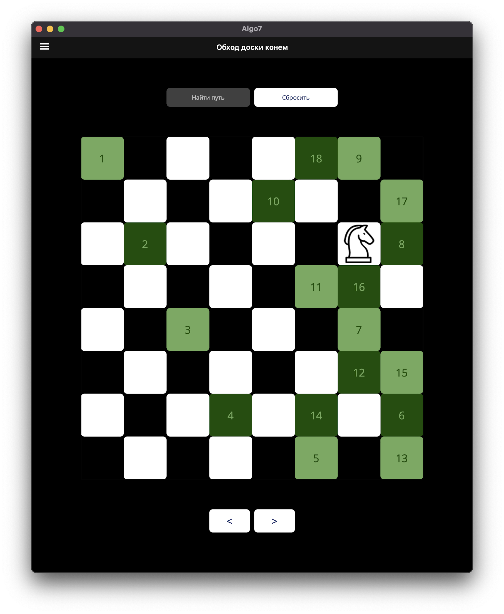
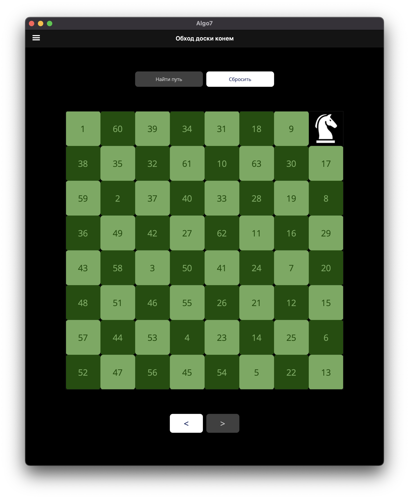

# 8-Queens / Knight's tour

	<table>
		<tr>
			<td></td>
			<td></td>
		</tr>
	</table>

## About

An application to solve and visualise 8-Queens and Knight's tour problems using backtracking.

## Functionality

### 8-Queens Problem

- Find one solution

	<table>
		<tr>
        <td></td>
        <td></td>
        </tr>
	</table>

- Find all possible solutions

	<table>
		<tr>
        <td></td>
        <td></td>
        </tr>
	</table>

### Knight's Tour

- Find a knight's tour from a given by a user position

	<table>
		<tr>
        <td></td>
        <td></td>
        <td></td>
        </tr>
	</table>

## Implementation

The program is implemented using C# and .NET MAUI.
